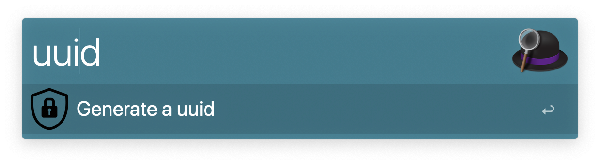

# Generating an Universally Unique Identifier v4 (UUID) on [Alfred](https://www.alfredapp.com).

## Installation

1. [Download the latest version](https://github.com/midnite81/alfred-uuid/releases/download/v1.0.0/alfred-uuid.alfredworkflow)
2. Install the workflow by double-clicking the `.alfredworkflow` file
3. You can add the workflow to a category, then click "Import" to finish importing. You'll now see the workflow listed in the left sidebar of your Workflows preferences pane.

## Usage

Just type `uuid` and press enter. This will create a UUID and copy it to your clipboard.